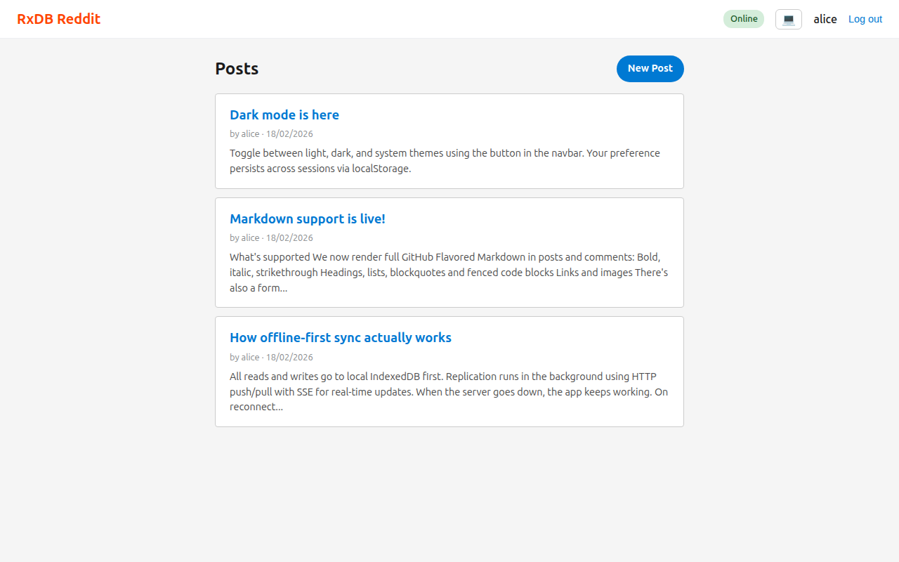
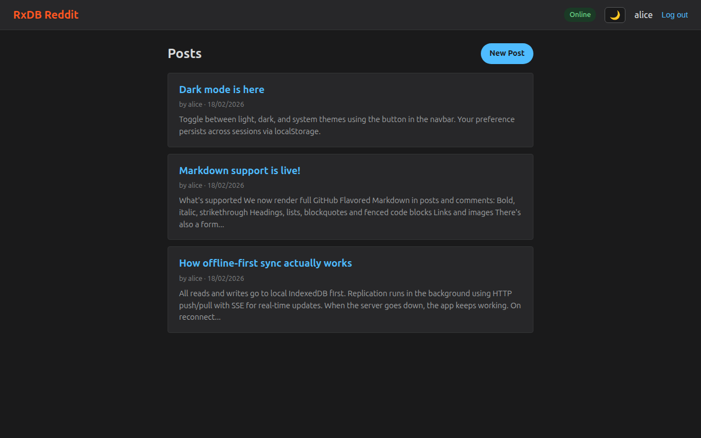
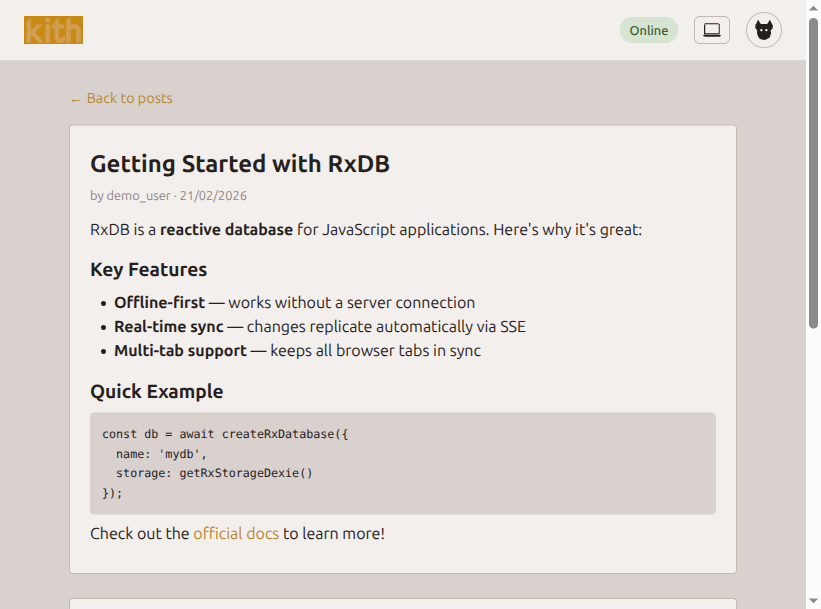
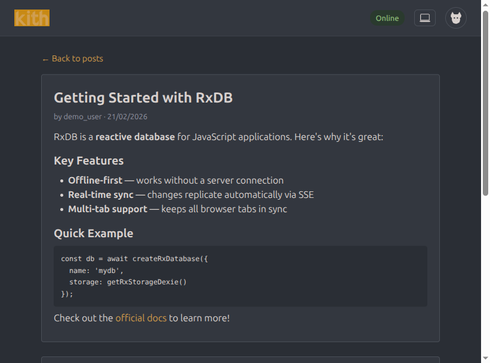
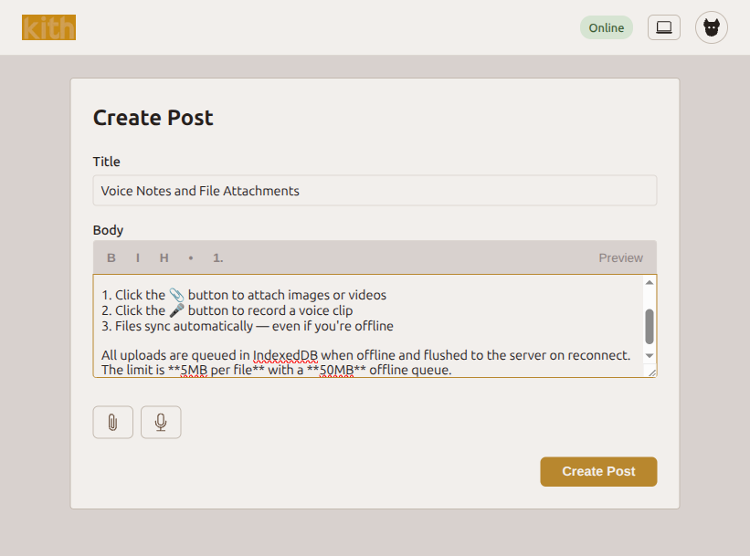
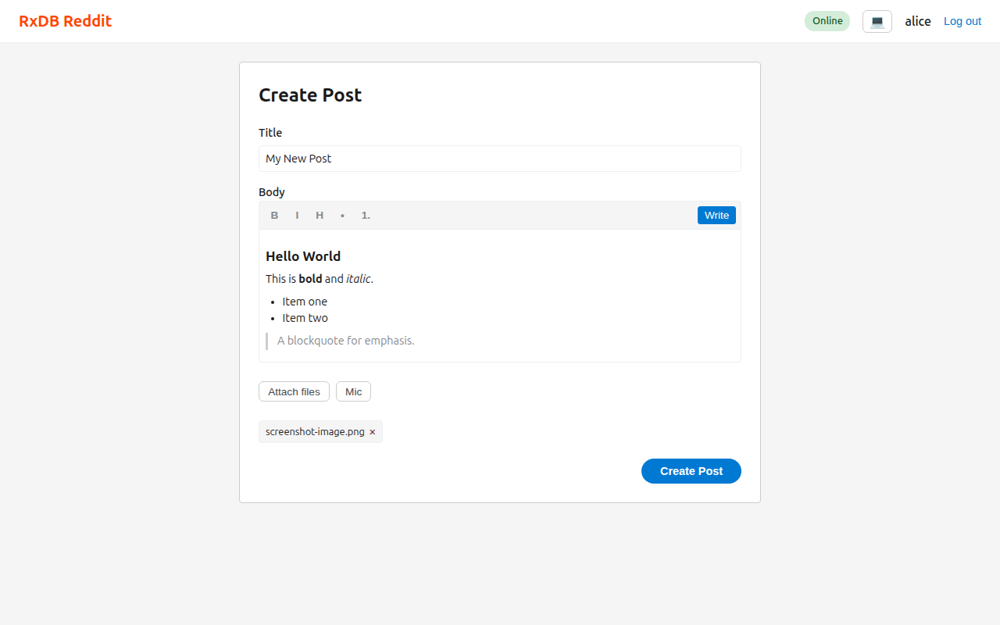
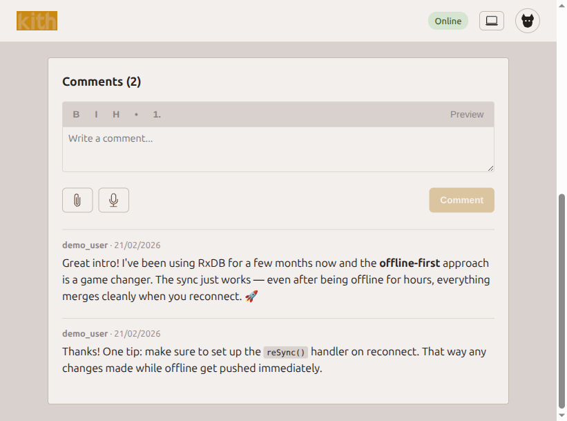

# RxDB Chat

https://github.com/user-attachments/assets/16133f61-89bc-491d-b7ec-474998bef545

An offline-first Reddit-style discussion app built with RxDB, React, and Express. Data is stored locally in IndexedDB and syncs to a SQLite backend via HTTP push/pull replication with real-time SSE updates.

Users can create posts, leave comments, and continue using the app while the server is down - everything syncs automatically when connectivity is restored.

## Screenshots

| Light mode | Dark mode |
|:---:|:---:|
|  |  |
|  |  |

| Create post | Markdown preview | Comments |
|:---:|:---:|:---:|
|  |  |  |

## Features

- **Markdown Support** — Write posts and comments using Markdown with a formatting toolbar and live preview. Renders GFM (GitHub Flavored Markdown) including tables, strikethrough, and task lists.
- **File Attachments** — Attach images and videos to posts and comments. Files are uploaded to the server (5MB limit) or queued offline (50MB queue limit) and synced when connectivity returns. Click images to view full-size in a lightbox.
- **Voice Recording** — Record voice clips directly in the browser using the MediaRecorder API. Recordings are saved as WebM/Opus audio and flow through the same attachment pipeline.
- **Dark Mode** — Light, dark, and system theme modes. Persists to localStorage and respects OS `prefers-color-scheme`. Toggle via the navbar button.
- **Offline-First** — All reads and writes happen locally. Full functionality without a server connection, with automatic sync on reconnect.

## Tech Stack

| Layer | Technology |
|-------|-----------|
| Client | React 18, React Router v6, TypeScript, Vite |
| Local DB | RxDB 16 with Dexie.js (IndexedDB) |
| Server | Express 4, better-sqlite3, JWT auth |
| Real-time | Server-Sent Events (SSE) via RxJS |
| Markdown | react-markdown, remark-gfm |
| Uploads | multer (server), IndexedDB offline queue (client) |
| Testing | Vitest + Supertest (server), Playwright (E2E) |

## Project Structure

```
rxdb-chat/
├── client/             React SPA (Vite dev server on :5173)
│   └── src/
│       ├── auth/       Auth context + API calls
│       ├── database/   RxDB setup, schemas, replication, upload queue/sync
│       ├── hooks/      useOnlineStatus, useMarkdownEditor, useAttachmentUpload, useVoiceRecorder
│       ├── components/ NavBar, PostCard, CommentForm, MarkdownToolbar, FilePicker, VoiceRecorder, etc.
│       ├── pages/      Login, Signup, Home, CreatePost, PostDetail
│       ├── theme/      ThemeContext (light/dark/system)
│       ├── utils/      stripMarkdown
│       └── styles/
├── server/             Express API (port 3001)
│   └── src/
│       ├── routes/     /auth, /replication, /upload
│       ├── middleware/  JWT auth middleware
│       ├── db.ts       SQLite setup + schema (users, posts, comments, attachments)
│       ├── sse.ts      RxJS Subject for broadcasting changes
│       └── app.ts      Express app factory
├── shared/             TypeScript interfaces shared by client + server
├── e2e/                Playwright end-to-end tests
└── playwright.config.ts
```

## Getting Started

### Prerequisites

- Node.js 18+
- npm 9+

### Install

```bash
npm install
```

### Run

```bash
npm run dev
```

This starts both the server (`:3001`) and client (`:5173`) in parallel. Open [http://localhost:5173](http://localhost:5173) in your browser.

You can also run them separately:

```bash
npm run server   # Express API on :3001
npm run client   # Vite dev server on :5173
```

## How It Works

### Offline-First Architecture

All reads and writes happen against the local RxDB/IndexedDB database first. The app is fully functional without a server connection.

Replication runs in the background using RxDB's replication plugin with a custom HTTP+SSE transport:

- **Push**: Local changes are POSTed to the server in batches with optimistic conflict detection
- **Pull**: The client fetches new documents using cursor-based pagination (`updatedAt` + `id`)
- **SSE Stream**: The server broadcasts changes in real-time so other clients receive updates immediately

Three collections are replicated: **posts**, **comments**, and **attachments**.

### File Uploads & Offline Queue

File attachments (images, video, audio) are uploaded to `POST /api/upload` and stored on disk. When the server is unreachable, files are queued in a separate IndexedDB store (`kith_uploads`) with a 50MB total limit. When the server comes back online, the upload sync worker flushes the queue and updates attachment documents with the server URL.

Limits:
- **5MB per file** (enforced client-side and server-side via multer)
- **50MB offline queue** (client-side IndexedDB)

### Server Recovery

When the server goes down and comes back:

1. **SSE heartbeats** - The server sends a heartbeat every 5 seconds. If the client receives nothing for 10 seconds, it considers the connection stale and reconnects
2. **Health polling** - The client polls `/api/health` every 5 seconds and tracks server status via an RxJS `BehaviorSubject`
3. **Auto-reconnect** - On reconnection, the client triggers `reSync()` to pull any missed changes
4. **Upload sync** - Pending file uploads are flushed from the offline queue

### Authentication

- Signup/login with username + password (bcrypt hashed)
- JWT tokens (7-day expiry) stored in `localStorage`
- SSE connections authenticate via `?token=` query parameter (since `EventSource` can't set headers)

### Theme System

The app supports three theme modes: **light**, **dark**, and **system** (follows OS preference). The active mode is persisted to `localStorage` and applied via `data-theme` attribute on `<html>`, with all colors defined as CSS custom properties.

## Scripts

| Command | Description |
|---------|-------------|
| `npm run dev` | Start server + client |
| `npm run server` | Start server only |
| `npm run client` | Start client only |
| `npm test` | Run server + client unit/integration tests |
| `npm run test:e2e` | Run Playwright E2E tests |
| `npm run clear-posts` | Soft-delete all posts and comments |

## Testing

### Unit & Integration Tests (Vitest)

```bash
npm test
```

48 tests across server and client:

**Server (34 tests):**
- Auth middleware (JWT sign/verify, Bearer + query param auth)
- Signup/login routes (validation, duplicates, credentials)
- Replication push/pull/conflict handling for posts, comments, and attachments
- File upload endpoint (mime filtering, size limits, static serving)

**Client (14 tests):**
- `stripMarkdown` utility (headings, bold, italic, strikethrough, code, links, images, lists, blockquotes, combined markdown)

Server tests use in-memory SQLite databases for full isolation.

### E2E Tests (Playwright)

```bash
npm run test:e2e
```

19 tests across six suites:

- **Auth** - Signup, login, duplicate username handling, unauthenticated redirects
- **Posts** - Create post, navigate to detail, verify on home page
- **Markdown** - Rendering on detail page, preview toggle, toolbar insertion, comment markdown, stripped preview on cards
- **Theme Switcher** - Cycling through light/dark/system, background color changes, persistence across reload
- **Attachments** - Image upload on post creation, remove pending file, image upload on comment
- **Offline Sync** - Two separate browsers: both post comments while the server is down, server restarts, both see each other's comments

The offline sync test launches two independent Chromium instances and manages the server lifecycle directly to verify real-world sync behavior.
